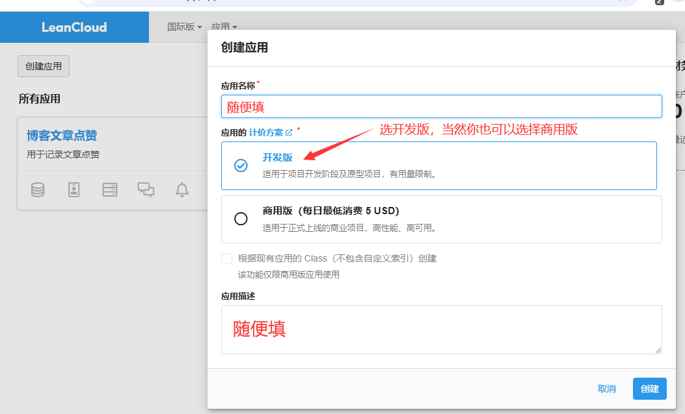
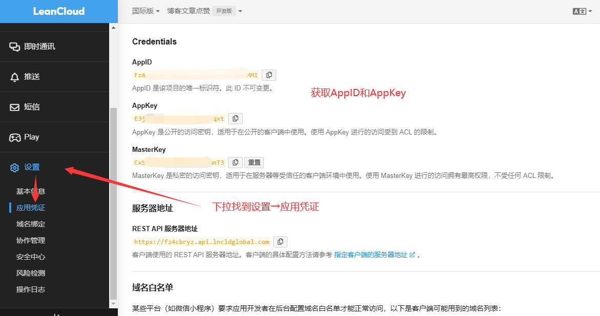
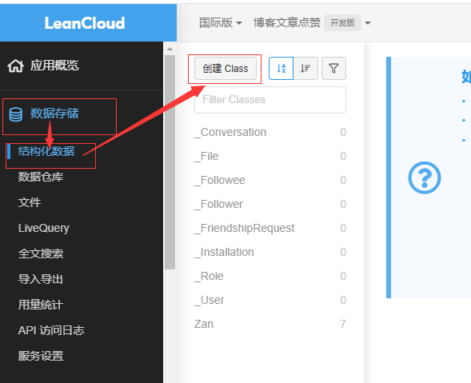

# Leancloud部署教程

下面开始部署教程，你需要有一个[**leancloud**账号](https://www.leancloud.com/)，没有的话就注册一个，只需要邮箱即可注册，无需绑定信用卡之类的，注册即用（中国大陆版要备案，可以使用国际版，备案要支付宝刷脸）。

在开始之前，你需要获取AppID和AppKEY这两个凭证：

## 1.初始化leancloud应用并获取凭证

注册好[**leancloud**账号](https://www.leancloud.com/)后进入控制台，点击创建应用，计费计划选择开发版，应用名称、描述随便填，

创建好后进入应用设置→点击应用凭证，将**AppID**和**AppKey**复制下来待会要用

然后打开数据存储→结构化数据，创建一个名为Zan的Class。

> leancloud有**中国版和国际版**，国际版**无需备案**，完成上述步骤即可使用，中国版需要**多一个步骤****绑定API域名**，在设置→域名绑定里。（根据服务条款域名好像要备案）

获取好凭证后就可以前往[前端部署](../../README.md#前端部署)进行下一步
