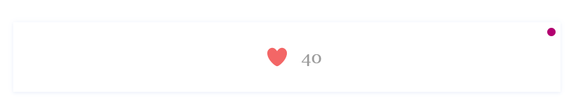
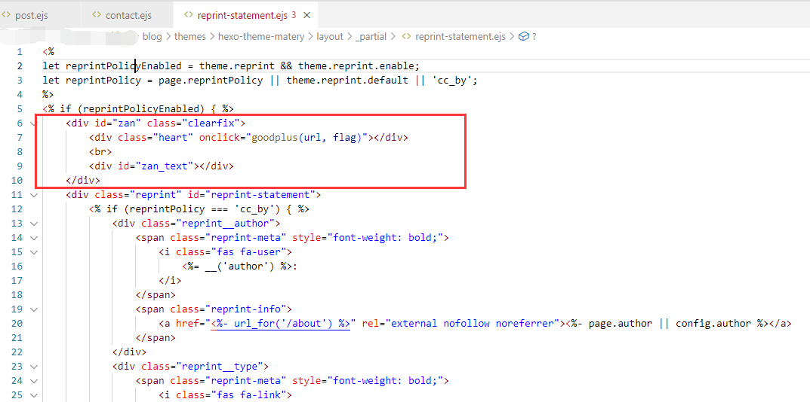
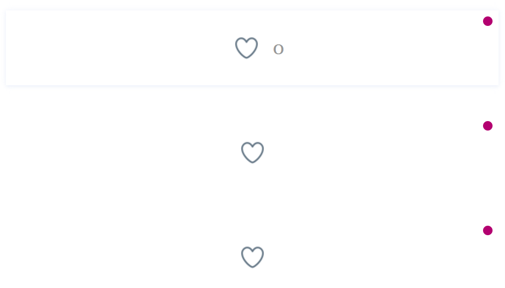
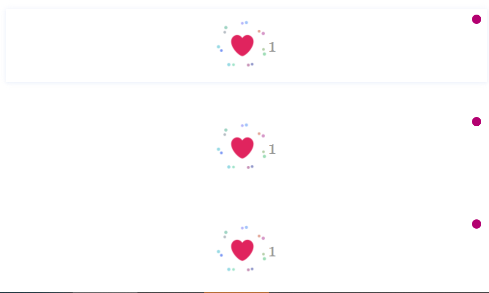
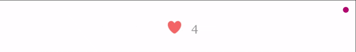

# Blog-Like 博客点赞插件

## 特点介绍

此点赞功能适配Hexo博客，适合任何静态网站，只是步骤有所不同，以下是它的特点：

1. 免费，支持 Cloudflare / LeanCloud / 自部署
2. 简洁，轻轻一点即可完成操作
3. 小巧，大小仅24.4kb（图像资源20kb）
4. 易用：Hexo 仅需三步安装

效果展示：


不仅仅是Hexo，所有静态博客都可以用，只是其他博客需要自己下载代码植入博客，Hexo可以一键安装

你可以到我的博客体验一下点赞功能哦 [立即前往](https://hcyhub.com/%E7%BD%91%E7%AB%99%E7%BB%B4%E6%8A%A4/Hexo%E7%82%B9%E8%B5%9E%E6%8F%92%E4%BB%B6) 

## 快速开始

### 后端部署

后端支持4种部署方法，分别是：

#### 1. 使用Cloudflare做后端（推荐，可白嫖，最简单）

[](https://deploy.workers.cloudflare.com/?url=https://github.com/2010HCY/Blog-Likes-Backend)

点击上方按钮一键部署后端，然后绑定自定义域（自带的workers.dev在中国大陆访问不稳定），部署好后默认路由是`example.com/like`

#### 2. 使用PHP做后端（相对简单）

[PHP部署教程](Backends/PHP/README.md)

#### 3. 使用OpenResty后端（高性能）

[OpenResty部署教程](Backends/OpenResty/README.md)

#### 4. 使用Leancloud做后端（不推荐，中国大陆要备案）

[Leancloud部署教程](Backends/Leancloud/README.md)

### 前端部署

#### 安装配置插件

> 适用于Hexo框架，其他框架我没用过

在博客根目录粘贴以下命令一键安装

```
npm install hexo-blog-like --save
```

安装好后在博客根目录的`_config.yml`（**不是你主题的`_config.yml`！**）添加以下配置项并填写：

```yml
Blog-Like:
  enable: true                   #是否启用插件
  AutoInjectLike: true           #是否开启自动添加点赞组件功能，默认关闭
  Backend: Cloudflare            #Cloudflare | Leancloud | PHP，默认Cloudflare
  CloudflareBackend:             #Cloudflare后端地址
  PHPBackend:                    #自部署PHP后端地址
  AppID:                         #如果使用Leancloud，在此填写Leancloud ID和KEY
  AppKEY:                        #Leancloud KEY
  GoogleAnalytics: true          #是否向谷歌分析发送点赞事件，默认关闭
  GAEventCategory: Engagement    #点赞事件类别，默认Engagement
  GAEventAction: Like            #事件名称，默认Like
```

后端地址可以用相对路径或绝对路径，例如`/api/like` or `https://example.com/api/like`

完事后`hexo clean && hexo g && hexo s`启动博客，在你想要的显示位置（例如文章末尾）插入如下代码块，打开博客瞅瞅效果吧！

```html
<div id="zan" class="clearfix">
    <div class="heart" onclick="goodplus(url, flag)"></div>
    <br>
    <div id="zan_text"></div>
</div>
```



如果你不想要手动一个个添加，你可以编辑主题的文章模板（通常位于主题/主题名/目录下的`layout/_partial/article.ejs`或`layout/post.ejs`文件）里添加此代码段。

> 我使用的主题是`matery`，该主题把代码段放置在`layout/_partial/reprint-statement.ejs`文件中最前面效果最好，其他主题视情况而定。
>
> 

#### 手动引入文件

下载项目根目录下的三个文件`zan.js`、`zan.css`、`zan.png`，手动配置JS文件头的配置项、CSS中的图片路径

zan.js需要改的地方：

```
// === 配置项 BEGIN ===
var BLOG_LIKE_CONFIG = {
    enable: true,
    Backend: "Cloudflare",           // Cloudflare | Leancloud | PHP
    CloudflareBackend: "",           // Cloudflare后端地址
    PHPBackend: "/like",             // PHP后端接口地址
    AppID: "",                       // Leancloud AppID
    AppKEY: "",                      // Leancloud AppKEY
    GoogleAnalytics: false,          // 是否启用谷歌分析事件追踪，默认关闭
    GAEventCategory: "Engagement",   // 事件类别，默认Engagement
    GAEventAction: "Like"            // 事件操作名称，默认Like
};
// === 配置项 END ===
```

zan.css需要改的地方：

```
#zan .heart {
  background: url(zan.png);   /* 把zan.png修改成实际图片路径或图床URL */
  background-position: left;
  background-repeat: no-repeat;
  height: 100px;
  width: 100px;
  background-size: 2900%;
  float: left;
  display: inline-block;
  position: relative;
  left: 0;
  top: 0;
  z-index: 0;
}
```

然后在HTML页面`<body>`标签后`</body>`前引入JS、CSS

```
<script type="text/javascript" src="js/zan.js" ></script>
<link rel="stylesheet" href="css/zan.css" />
```

对你有帮助的话给我个Starred吧！

[](https://github.com/2010HCY/Blog-Like)

## 未来打算

- [x] 此脚本目前没有限制点赞次数，同一个访客可以不停的搓点赞次数，搓个上万次不成问题，未来打算加入一个开关选择是否限制单访客点赞次数，若打开则通过Cookie记录限制只能点一次赞或几次。
- [x] 制作成Hexo插件，可以一键安装使用
- [ ] 制作多种样式以供选择
- [x] 支持多种存储方式
- [x] 长期接收意见以及维护

## 其他

### 项目目录说明

```
Blog-Like
├── Backends/        # 后端
├── Hexo-Blog-Like/  # Hexo插件
├── zan.css
├── zan.js
└── zan.png
```

根目录下的zan.js是完整版JS，适合在非Hexo网站上引入使用，可删除未使用的函数凹一凹空间。

## 版本更新记录

<details>
<summary>点击展开</summary>

**v4.0.3 (2026.03.16)**

前端JS能够处理同一个页面上多个点赞组件，不再会因为有多组件导致只有第一个组件能正常显示点赞量。





**v4.0.2 (2026.03.14)**

更新点赞精灵图

更新前后对比：




分类文件，文档修改

**v4.0.1 (2026.03.12)**

新增自动添加点赞组件到文章末尾功能

**v4.0.0 (2026.03.12)**

不再允许同一个访客多次点赞同一个页面，现版本只允许点一次赞，再次点击取消点赞

后端地址可以填写相对路径、绝对路径，如`/api/like` or `https://example.com/api/like`

新增了OpenResty路由模块

**注意，v3.* 升级到v4.* 需要更新后端！**

**v3.0.0 (2025.12.03)**

不再使用URL传参，改为Post JSON，避免爬虫扫接口，添加新的存储PHP
**注意，v2.* 升级到v3.* 需要更新后端！**

**v2.2.2 (2025.5.28)**

添加了谷歌分析发送事件功能，能够在谷歌分析里查看统计数据

**v2.2.1 (2025.5.17)**

添加了速率限制提示，现在你们可以用Cloudflare速率限制规则了

**v2.2.0 (2025.4.20)**

增加了Cloudflare存储点赞数据方式

**v2.1.2 (2025.2.06)**

修复了运行报错。

**v2.1.1 (2025.1.23)**

添加了中国版leancloud适配

**v2.1.0 (2025.1.16)**

修复了多个页面只能点五个赞，新版本把不同URL分开计算

**v2.0.0 (2025.1.15)**

发布npm包，可以在Hexo博客中一键安装咯！

**v1.1.0 (2025.1.15)**

增加了点赞次数限制，使用Cookie记录点赞次数，优化了代码逻辑

**v1.0.0 (2025.1.14)**

博客点赞插件横空出世 

</details>